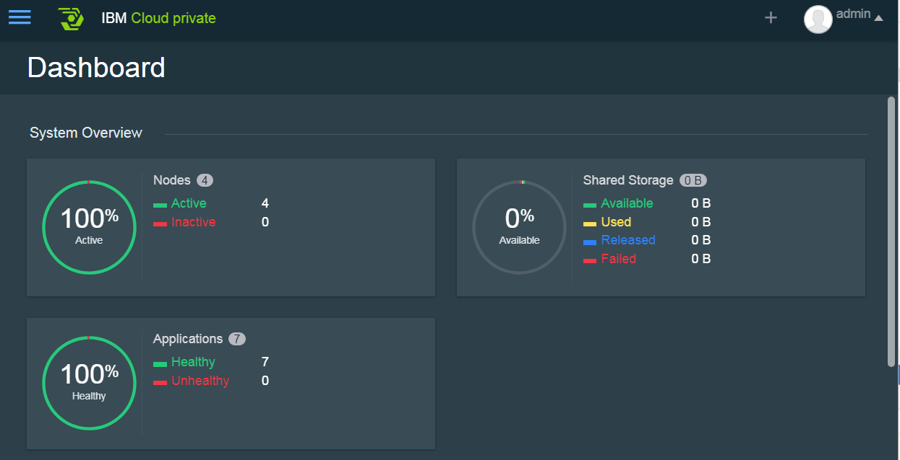

# Setup IBM Cloud Private

IBM Cloud Private V1.2 is setup on 4 nodes Ubuntu cluster using ruby/rake automation

## Prerequisite
- VirtualBox installed
- Ruby installed - 
  [windows version download here](https://github.com/oneclick/rubyinstaller2/releases/download/2.4.1-2/rubyinstaller-2.4.1-2-x64.7z)
- Install the following ruby gems
```
gem install dotenv
gem install sshkit_addon
```
- 100+ GB hard disk space
- More than 16GB memory on host
- genisoimage is needed to create ISO image. [Cygwin](https://cygwin.com/install.html) is therefore required.
- ICP installer and image files are download from IBM passport advantage web site.
- Optional [cmder](https://github.com/cmderdev/cmder) installed for Windows

## Prepare Ububtu OVA

Ideally the Ubuntu cloud image is the best candidate to setup the VM. However the current version of the cloud image doesn't boot [Ubuntu](https://cloud-images.ubuntu.com/xenial/current/xenial-server-cloudimg-amd64.ova). See the issue [here](https://bugs.launchpad.net/cloud-images/+bug/1573095) 

Therefore, a self created ova is used instead. It is based on Ubuntu 16.04 server. Take note:
- install the cloud-init package after setup.
- create OVA as a template for clone.

## Create configurations 
clone the git. Update .env file based on your environment
A sample .env file is listed below.

```
VBOXMANAGE=C:\Program Files\Oracle\VirtualBox\VBoxManage.exe

FLEET_HOME=E:\MyVM\Ubuntu
OVA_IMAGE=files\UbuntuTemplate.ova

COUNT_OF_VMS=4

PUBKEY=ssh-rsa AAAAB3NzaC1yc2EAAAABJQAAAQEAju2TnrXY4EnOweodE3k8PrE5q12OhcDHdlstNosyrRKPqoTU0X2xF8hq2GiylJ4zKFp1TgrJy120M7dtlxQmHuXRTBMFvQejgXRIm69qLPsxKMWIUuBbVB1K+LlQWAqml0BjRAD7plq7NMksKAHzLbviP0o7V1HylO5ZuG5WPZw/10lKN09EJDXg1TShwHlRzE03fhYldRAfYjXIGvVJ1OXDWdWi8PW6V0OkoJmGmZa/C+D41ZbxrjarKYeZ00EIlk53ndeXsnGTZ/y7CeDBIhDIBK+/CtgFolB/i3yr+FjNDW/oCeGQsoXdn7tvCY6hcLN4ykQawzIvRxN0am7wZQ== rsa-key-20160621

#private key
MYKEY=C:\Tools\Kitty\mykey.openssh

DOCKER_PACKAGE_VERSION=17.03.2~ce-0~ubuntu-xenial

#the start node is also the master
NODE_IP_START=192.168.10.100 
NODE_GATEWAY=192.168.10.1
NODE_DNS=192.168.10.1

MASTER_HOSTNAME_IP=master ubuntu1,192.168.10.100
WORKER_HOSTNAME_IP=minion1 ubuntu2,192.168.10.101;minion2 ubuntu3,192.168.10.102
PROXY_HOSTNAME_IP=icpproxy ubuntu4,192.168.10.103

ICP_IMAGE_ON_HOST=C:\Users\IBM_ADMIN\Downloads\ibm-cloud-private-x86_64-1.2.0.tar.gz
ICP_INSTALLER_ON_HOST=C:\Users\IBM_ADMIN\Downloads\ibm-cloud-private-installer-1.2.0.tar.gz
```

## Build
```
cd icp-ubuntu
rake -T
rake sw:01_increase_filesystem          # increase filesystem size
rake sw:02_install_docker               # install docker
rake sw:03_install_python               # install python
rake sw:04_update_etc_hosts             # update hosts
rake sw:05_tune                         # tune system parameters
rake sw:06_create_ssh_key               # create ssh key
rake sw:07_untar                        # untar
rake sw:08_load_docker_image            # load docker image
rake sw:09_config                       # prepare install config
rake sw:10_move_image                   # move image
rake sw:11_install                      # install
rake sw:12_install_kubectl              # install kubectl
rake sw:13_config_kubectl               # configure kubectl
rake util:run_command[cmd]              # run command
rake util:run_command_on[host_key,cmd]  # run command on a specific host
rake vm:00_build_fleets                 # build fleet (4 ubuntu VMs)
rake vm:01_create_cloud_init_iso        # create cloud-init iso and mount t...
rake vm:02_start_vm                     # bootup vm
rake vm:03_ssh_portforward              # portforward for ssh
```

First build the VM fleets, run the rake task under the namespace of "vm" one by one, ie
```
rake vm:00_build_fleets
rake vm:01_create_cloud_init_iso
rake vm:02_start_vm
rake vm:03_ssh_portforward

```

Then, install IBM Cloud Private step by step as
```
rake sw:01_increase_filesystem
rake sw:02_install_docker
rake sw:03_install_python
rake sw:04_update_etc_hosts
rake sw:05_tune
rake sw:06_create_ssh_key
rake sw:07_untar
rake sw:08_load_docker_image
rake sw:09_config
rake sw:10_move_image
rake sw:11_install
rake sw:12_install_kubectl
rake sw:13_config_kubectl
```

step 11 took about 20 miniutes on my W541 laptop.

## Result


Use kubectl command line
```
ubuntu@ubuntu1:~$ kubectl get pods --all-namespaces
NAMESPACE     NAME                                        READY     STATUS    RESTARTS   AGE
kube-system   calico-node-amd64-11rr8                     2/2       Running   0          11h
kube-system   calico-node-amd64-7h5tq                     2/2       Running   0          11h
kube-system   calico-node-amd64-gmp0g                     2/2       Running   0          11h
kube-system   calico-node-amd64-gn2h7                     2/2       Running   0          11h
kube-system   calico-policy-controller-3611020521-jsgt9   1/1       Running   0          11h
kube-system   default-http-backend-2244879088-vm5hp       1/1       Running   0          11h
kube-system   filebeat-amd64-4h9cn                        1/1       Running   0          11h
kube-system   filebeat-amd64-6t2hq                        1/1       Running   0          11h
kube-system   filebeat-amd64-6wlc5                        1/1       Running   0          11h
kube-system   filebeat-amd64-tk8rx                        1/1       Running   0          11h
kube-system   heapster-1972661774-s1p2r                   2/2       Running   1          11h
kube-system   image-manager-93m3l                         2/2       Running   0          11h
kube-system   k8s-auth-192.168.10.100                     2/2       Running   0          11h
kube-system   k8s-elasticsearch-192.168.10.100            3/3       Running   0          11h
kube-system   k8s-etcd-192.168.10.100                     1/1       Running   0          11h
kube-system   k8s-mariadb-192.168.10.100                  1/1       Running   0          11h
kube-system   k8s-master-192.168.10.100                   3/3       Running   0          11h
kube-system   k8s-proxy-192.168.10.100                    1/1       Running   0          11h
kube-system   k8s-proxy-192.168.10.101                    1/1       Running   0          11h
kube-system   k8s-proxy-192.168.10.102                    1/1       Running   0          11h
kube-system   k8s-proxy-192.168.10.103                    1/1       Running   0          11h
kube-system   k8s-router-192.168.10.100                   1/1       Running   0          11h
kube-system   kube-dns-793527063-687r5                    3/3       Running   0          11h
kube-system   logstash-590047985-cm8bz                    1/1       Running   0          11h
kube-system   nginx-ingress-lb-amd64-l0lp0                1/1       Running   0          11h
kube-system   rescheduler-27w7c                           1/1       Running   0          11h
kube-system   tiller-2024849437-7kgrc                     1/1       Running   0          11h
kube-system   unified-router-818862186-3cqfp              2/2       Running   2          11h
```

